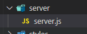
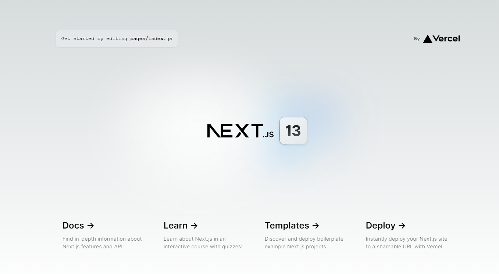

# Express + Next.js Boilder Plate

기존 Express 환경에 Next.js를 사용할 수 있도록 설정하는 방법입니다.

## 설치

> 먼저 Next.js 프로젝트를 생성합니다.

```shell
npx create-next-app@latest

# √ What is your project named? ... client
# √ Would you like to use TypeScript with this project? ... No
# √ Would you like to use ESLint with this project? ... Yes
```

<table align="center">
    <tr>
        <th>기존 폴더 구조</th>
        <th>src 사용</th>
    </tr>
    <tr>
        <td></td>
        <td></td>
    </tr>
</table>

> Express 를 설치합니다.

```shell
npm install --save express dotenv

# 서버 자동 재시작을 위한 패키지
npm install --save-dev nodemon
```

## Express 서버 생성

> Express 서버파일을 작성합니다.

<table>
<tr>
<td>

- 생성한 Next.js 프로젝트 폴더에 server 폴더 생성
- server.js 파일에 Express 서버를 실행하기 위한 코드 작성

</td>
<td></td>
</tr>
</table>

```js
const express = require('express');
const dotenv = require('dotenv');
dotenv.config({ path: '.env' }); // 환경변수 사용

const app = express();
const port = process.env.PORT; //.env 파일에서 설정해준다

app.set('port', port);
app.use(express.json());
app.use(express.urlencoded({ extended: false }));

app.use('/', (req, res, next) => {
  res.send('hello!');
});

app.listen(app.get('port'), () => {
  console.log(`Express server listen port:${port}`);
  console.log(`http://localhost:${port}`);
});
```

## Next.js 서버 설정추가

> server/server.js 파일에 next.js 서버 설정을 추가합니다.

```shell
# .env
SERVER_PORT=[YOUR_PORT]
```

```js
const express = require('express');
const dotenv = require('dotenv');
dotenv.config({ path: '.env' }); // 환경변수 사용
const path = require('path');

/** Create Express */
const app = express();

/** Next.js 모듈 가져오기 */
const next = require('next');
const { parse } = require('url');

/** Next.js 설정 */
const port = process.env.SERVER_PORT;
/**
 * 개발환경이아니라면 dev 옵션을 false 로 설정하고
 * 서버 시작전에 next build 를 실행해준다.
 */
const nextApp = next({ dev: true, port });
const handle = nextApp.getRequestHandler();

nextApp
  .prepare()
  .then(() => {
    /** Express Settings */
    app.use(express.json());
    app.use(express.urlencoded({ extended: true }));
    /** static 경로 설정 */
    app.use(express.static(path.join(__dirname, '../', 'public')));

    /** Express Router Settings */
    app.use('/api', (req, res, next) => {
      res.send('hello!');
    });

    /** Next.js Routing */
    app.get('/', (req, res) => {
      const parsedUrl = parse(req.url, true);
      const { pathname, query } = parsedUrl;
      nextApp.render(req, res, pathname, query);
    });
    app.get('*', (req, res) => {
      return handle(req, res);
    });

    app.listen(port, () => {
      console.log(`Express server listen port:${port}`);
      console.log(`http://localhost:${port}`);
    });
  })
  .catch((ex) => {
    console.error(ex.stack);
    process.exit(1);
  });

module.exports = app;
```

## 실행 설정

> package.json 파일의 시작명령어 script를 Express를 사용하도록 수정합니다.

```json
// package.json
...,
"scripts": {
    "dev": "node server/server.js",
    "build": "next build",
    "start": "next start",
    "lint": "next lint"
  },
...
```

> nodemon을 사용

```json
// package.json
...,
"scripts": {
    "dev": "nodemon server/server.js",
  },
...
```

> nodemon 설정파일 사용

- nodemon.json 파일을생성

```json
// nodemon.json
{
  "watch": ["server/server.js", "server/src"],
  "exec": "node server/server.js",
  "ext": "js json"
}
```

- script 수정

```json
// package.json
...,
"scripts": {
    "dev": "nodemon",
  },
...
```

## 시작

> 모든 설정이 완료되었습니다!<br/>이제 시작명령어를 입력하고 Express를 Custom 서버로 사용하는 Next.js를 시작해보세요.

```shell
npm run dev
```


````

## 참조

- [Next.js 공식문서](https://nextjs.org/docs)

- [Next.js Custom Server](https://nextjs.org/docs/advanced-features/custom-server)
